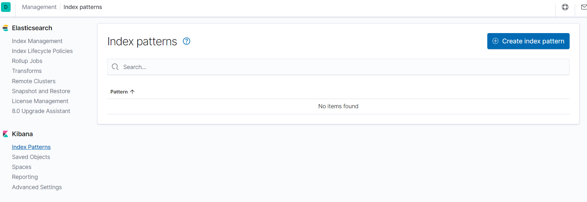
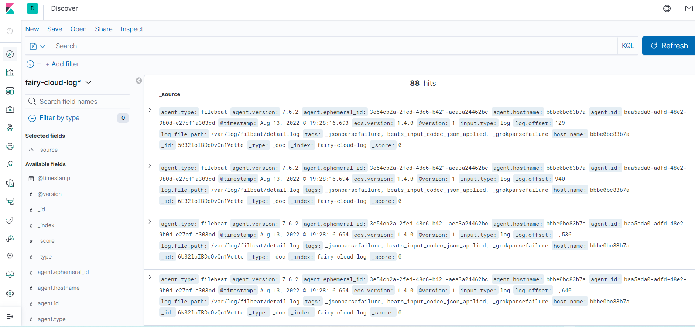
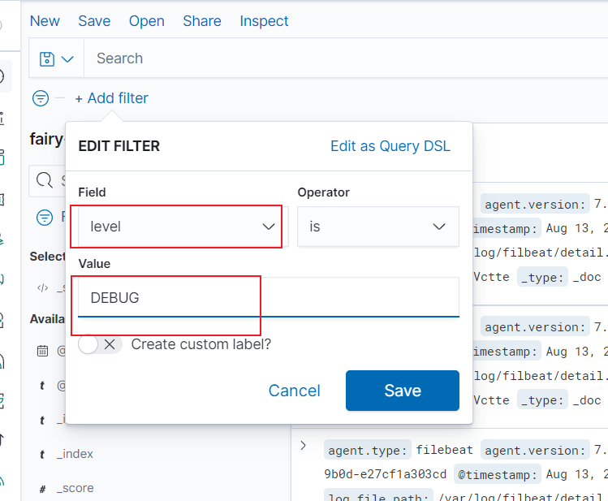
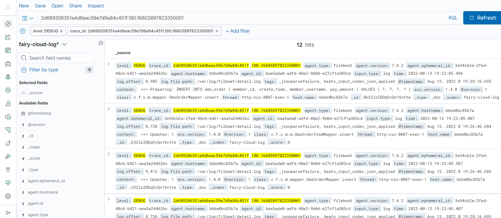

# fairy-alibaba-cloud

#### 介绍
使用阿里 spring cloud开源组件开发  根据电商的下单场景 使用相关组件实现服务功能

```
主要使用组件：
Nacos
Seata
Sentinel
GateWay
OAth2（Spring Security ,Jwt)
Feign/Ribbon调用
SkayWalking链路分析
ELK日志分析（ElasticSearch,Kibana,FileBean Logstash都会使用）
zipkin 日志追踪
Mq(kafka,rocketmq,rabbitmq都会使用到）
ES 搜索 倒排索引

```

DB使用

```
Mysql
Redis
MongoDB
```

#### Ribbon 调用

```
 //RestTemplate调用 使用负载均衡器 查看fairy-cloud-stock 服务 会从服务列表选择一个服务调用
 url = "http://fairy-cloud-stock/stock/deduce?productId=" + productId;
 CommonResponse rs = restTemplate.getForObject(url, CommonResponse.class);
```
 // RestTemplate这里使用的是 AbstractClientHttpRequest 去执行 execute 执行之前会在ClientHttpRequestInterceptor接口进行拦截   LoadBalancerInterceptor 实现了ClientHttpRequestInterceptor接口

```
public abstract class AbstractClientHttpRequest implements ClientHttpRequest {
       @Override
	public final ClientHttpResponse execute() throws IOException {
		assertNotExecuted();
		ClientHttpResponse result = executeInternal(this.headers);
		this.executed = true;
		return result;
	}
}
```


#### Feign远程调用
引入springcloud-open-feign spring cloud 为openfeign提供了spring mvc 注解配置

```
<dependency>
   <groupId>org.springframework.cloud</groupId>
   <artifactId>spring-cloud-starter-openfeign</artifactId>
</dependency>
```
 spring mvc注解配置api
    
```
@FeignClient(value = "fairy-cloud-order", path = "/order",configuration = FeignConfig.class)
   public interface OrderFeign {
        @RequestMapping(value = "/create", method = RequestMethod.PUT)
        @ResponseBody
        CommonResponse<OmsOrderPO> createOrder(@RequestBody OmsOrderParamDTO omsOrderItemPO);
}
```
使用openFeign原生的注解

```
配置类
@Configuration
public class FeignConfig {
    @Bean
    public Contract contract() {
        return new Contract.Default();
    }
}
```

```
@FeignClient(value = "fairy-cloud-order", path = "/order",configuration = FeignConfig.class)
public interface OrderFeign {
 @RequestLine("GET /deduce}")
 CommonResponse<PmsStockPO> deduceStock(@Param("productId") Integer productId);
}
  
```

#### Feign配置使用HtppClient远程调用
默认Feign是使用HttpURLConnection 来作为http远程调用请求的，源码可以参考 feign包下的Client接口

```
public interface Client {
    class Default implements Client {

    private final SSLSocketFactory sslContextFactory;
    private final HostnameVerifier hostnameVerifier;
    
    ......
    
    @Override
    public Response execute(Request request, Options options) throws IOException {
      HttpURLConnection connection = convertAndSend(request, options);
      return convertResponse(connection, request);
    }
    
    }

   HttpURLConnection convertAndSend(Request request, Options options) throws IOException {
      final URL url = new URL(request.url());
      final HttpURLConnection connection = this.getConnection(url);
      if (connection instanceof HttpsURLConnection) {
        HttpsURLConnection sslCon = (HttpsURLConnection) connection;
        if (sslContextFactory != null) {
          sslCon.setSSLSocketFactory(sslContextFactory);
        }
        if (hostnameVerifier != null) {
          sslCon.setHostnameVerifier(hostnameVerifier);
        }
      }
      connection.setConnectTimeout(options.connectTimeoutMillis());
      connection.setReadTimeout(options.readTimeoutMillis());
      connection.setAllowUserInteraction(false);
      connection.setInstanceFollowRedirects(options.isFollowRedirects());
      connection.setRequestMethod(request.httpMethod().name());

      Collection<String> contentEncodingValues = request.headers().get(CONTENT_ENCODING);
      boolean gzipEncodedRequest =
          contentEncodingValues != null && contentEncodingValues.contains(ENCODING_GZIP);
      boolean deflateEncodedRequest =
          contentEncodingValues != null && contentEncodingValues.contains(ENCODING_DEFLATE);

      boolean hasAcceptHeader = false;
      Integer contentLength = null;
      for (String field : request.headers().keySet()) {
        if (field.equalsIgnoreCase("Accept")) {
          hasAcceptHeader = true;
        }
        for (String value : request.headers().get(field)) {
          if (field.equals(CONTENT_LENGTH)) {
            if (!gzipEncodedRequest && !deflateEncodedRequest) {
              contentLength = Integer.valueOf(value);
              connection.addRequestProperty(field, value);
            }
          } else {
            connection.addRequestProperty(field, value);
          }
        }
      }
      // Some servers choke on the default accept string.
      if (!hasAcceptHeader) {
        connection.addRequestProperty("Accept", "*/*");
      }

      if (request.body() != null) {
        if (disableRequestBuffering) {
          if (contentLength != null) {
            connection.setFixedLengthStreamingMode(contentLength);
          } else {
            connection.setChunkedStreamingMode(8196);
          }
        }
        connection.setDoOutput(true);
        OutputStream out = connection.getOutputStream();
        if (gzipEncodedRequest) {
          out = new GZIPOutputStream(out);
        } else if (deflateEncodedRequest) {
          out = new DeflaterOutputStream(out);
        }
        try {
          out.write(request.body());
        } finally {
          try {
            out.close();
          } catch (IOException suppressed) { // NOPMD
          }
        }
      }
      return connection;
    }
  }
}
```

配置Feign使用HttpCLient

```
<dependency>
    <groupId>io.github.openfeign</groupId>
    <artifactId>feign-httpclient</artifactId>
    <version>10.10.1</version>
</dependency>
```
feign-httpclient包要和feign-core的版本保持一致
application.properties配置激活 feign.httpclient.enabled=true


HttpClient配置 需要注入为Bean
Feign的自动装配配置类 FeignRibbonClientAutoConfiguration

```
@Import({ HttpClientFeignLoadBalancedConfiguration.class,
		OkHttpFeignLoadBalancedConfiguration.class,
		DefaultFeignLoadBalancedConfiguration.class })
public class FeignRibbonClientAutoConfiguration {
```
查看HttpClientFeignLoadBalancedConfiguration 

```
@Configuration(proxyBeanMethods = false)
@ConditionalOnClass(ApacheHttpClient.class)
@ConditionalOnProperty(value = "feign.httpclient.enabled", matchIfMissing = true)
@Import(HttpClientFeignConfiguration.class)
class HttpClientFeignLoadBalancedConfiguration {
```

配置HttpClient 

```
    @Bean
    public HttpClient httpClient(HttpClientBuilder httpClientBuilder) {
        return httpClientBuilder.build();
    }

    @Bean
    public PoolingHttpClientConnectionManager manager() {
        PoolingHttpClientConnectionManager manager = new PoolingHttpClientConnectionManager();
        manager.setMaxTotal(1000);
        manager.setDefaultMaxPerRoute(200);
        return manager;
    }

    @Bean
    public HttpClientBuilder httpClientBuilder(PoolingHttpClientConnectionManager manager) {
        RequestConfig requestConfig = RequestConfig.custom().setConnectTimeout(3000).setSocketTimeout(1500)
                .setConnectionRequestTimeout(1500).build();

        HttpClientBuilder builder = HttpClientBuilder.create();
        builder.setConnectionManager(manager);
        builder.setDefaultRequestConfig(requestConfig);
        builder.setRetryHandler(new DefaultHttpRequestRetryHandler(0, false));
        return builder;
    }
```


#### SkyGateWay 链路追踪接入
```
-javaagent:C://apache-skywalking//agent//skywalking-agent.jar 
-DSW_AGENT_COLLECTOR_BACKEND_SERVICES=node01:11800
-DSW_AGENT_NAME=fairy-cloud-gateway
```
关于链路不显示gateWay官网层的，需要拷贝agent/optional-plugins目录下的gateway插件到agent/plugins目录

## 日志收集存储
logstash下载： https://www.elastic.co/cn/downloads/past-releases/logstash-7-17-3
filebeat下载： https://www.elastic.co/cn/downloads/past-releases/filebeat-7-17-3

docker 安装配置filebeat logstash


docker启动filebeat指定配置文件

```
docker stop fileBeat  && docker rm fileBeat
docker run -d --name=fileBeat \
-v /mydata/fileBeat/fileBeat-logstash.yml:/usr/share/filebeat/fileBeat-logstash.yml \
-v /mydata/fileBeat/log:/var/log/filbeat \
elastic/filebeat:7.6.2  filebeat -e -c fileBeat-logstash.yml
```

logstash启动测试：

```
bin/logstash -e 'input { stdin { } } output { stdout {} }'
```

配置 filebeat-logstash.yml

```
filebeat.inputs:
- type: log
  enabled: true
  paths:
    - /var/log/filbeat/*.log
  multiline.pattern: '^\d{4}\-\d{2}\-\d{2}\s\d{2}\:\d{2}\:\d{2}\.\d{3}'
  multiline.negate: true
  multiline.match: after
#----------------------------- Logstash output --------------------------------
output.logstash:
  hosts: ["node01:5044"]
```

logstash解析 fileBeat输入的日志信息

```
input {
    beats {
        port => 5044
        codec => "json"
    }
}

filter {
    grok {
        match => {
          "message" => "(?<time>\d{4}\-\d{2}\-\d{2}\s\d{2}\:\d{2}\:\d{2}\.\d{3})\s(?<level>\w{4,5})\s+\T\I\D\:\s*(?<trace_id>[0-9a-f.]{53,54})\s%{DATA:thread}\s%{DATA:class}\:%{GREEDYDATA:content}"
        }
    }
    mutate {
        remove_field => "message" # 删除原始日志内容节省存储和带宽
    }
}

output {
    elasticsearch {
        hosts => ["node01:9200"]
        index => "fairy-cloud-log" # ES 重建立索引
    }
}
```

启动logstash

```
bin/logstash -f config/logstash-trance.conf 
```
logstash example: https://www.elastic.co/guide/en/logstash/7.17/config-examples.html

```
input { stdin { } }

filter {
  grok {
    match => { "message" => "%{COMBINEDAPACHELOG}" }
  }
  date {
    match => [ "timestamp" , "dd/MMM/yyyy:HH:mm:ss Z" ]
  }
}

output {
  elasticsearch { hosts => ["localhost:9200"] }
  stdout { codec => rubydebug }
}

```
input:

```
127.0.0.1 - - [11/Dec/2013:00:01:45 -0800] "GET /xampp/status.php HTTP/1.1" 200 3891 "http://cadenza/xampp/navi.php" "Mozilla/5.0 (Macintosh; Intel Mac OS X 10.9; rv:25.0) Gecko/20100101 Firefox/25.0"

```
展示数据：

```
{
        "message" => "127.0.0.1 - - [11/Dec/2013:00:01:45 -0800] \"GET /xampp/status.php HTTP/1.1\" 200 3891 \"http://cadenza/xampp/navi.php\" \"Mozilla/5.0 (Macintosh; Intel Mac OS X 10.9; rv:25.0) Gecko/20100101 Firefox/25.0\"",
     "@timestamp" => "2013-12-11T08:01:45.000Z",
       "@version" => "1",
           "host" => "cadenza",
       "clientip" => "127.0.0.1",
          "ident" => "-",
           "auth" => "-",
      "timestamp" => "11/Dec/2013:00:01:45 -0800",
           "verb" => "GET",
        "request" => "/xampp/status.php",
    "httpversion" => "1.1",
       "response" => "200",
          "bytes" => "3891",
       "referrer" => "\"http://cadenza/xampp/navi.php\"",
          "agent" => "\"Mozilla/5.0 (Macintosh; Intel Mac OS X 10.9; rv:25.0) Gecko/20100101 Firefox/25.0\""
}
```


### filebeat测试控制台输出

```
# 输入
filebeat.inputs:
  # 标准输入
- type: stdin
  enabled: true
 
# 输出
# 输出到控制台
output.console:
  pretty: true
  enable: true
```

```
filebeat.inputs:
- type: log
  enabled: true
  paths:
    - /var/log/filbeat/*.log
  multiline.pattern: '^\d{4}\-\d{2}\-\d{2}\s\d{2}\:\d{2}\:\d{2}\.\d{3}'
  multiline.negate: true
  multiline.match: after

output.console:
    pretty: true
    enable: true
```

grok分析日志链接

http://node01:5601/app/kibana#/dev_tools/grokdebugger?_g=(refreshInterval:(pause:!t,value:0),time:(from:now%2Fd,mode:quick,to:now%2Fd))

翻墙链接：

http://grokdebug.herokuapp.com/

http://grokconstructor.appspot.com/

### Kibana展示查看
打开kibana页面
http://node01:5601/app/kibana#/home
进入manager http://node01:5601/app/kibana#/management?_g=() 新建一个index Patterns


打开 Discover  http://node01:5601/app/kibana#/discover?_g=()&_a=(columns:!(_source),index:d0bbde80-1afb-11ed-ba40-6375c3d223b8,interval:auto,query:(language:kuery,query:''),sort:!(!(_score,desc)))


根据条件进行筛选：



这时我们可以根据链路的tranceId来查询  筛选




### 修改点
1: 下订单的 入参修改

